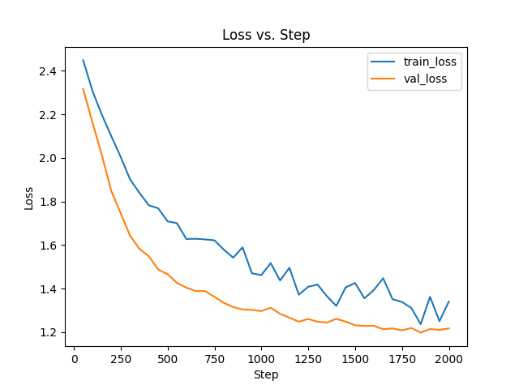

# TaylorGPT

A transformer decoder model for generating Taylor Swift lyrics built from scratch using PyTorch including implementations for masking, multi-head attention and transformer blocks.

The model is trained on a dataset of 200 song lyrics from Taylor Swift's discography.

## Installation

You can install the required packages using the following command:

```
pip install -r requirements.txt
```

## Data

### Dataset

The data is stored in the `data` folder. The `data` folder contains the following files:

- `raw_taylor_swift_lyrics.txt`: The raw data file containing the lyrics of 200 songs by Taylor Swift.
- `taylor_swift_lyrics.txt`: The preprocessed data file containing the lyrics of 200 songs by Taylor Swift. The preprocessing steps include:
  - Removing metadata lines about embedding
- `vocab.txt`: The vocabulary file containing the unique words in the dataset. The vocabulary contains the unique characters in the dataset.

### Data Collection

Although the data is part of the repository, you may want to collect the data yourself for a different artist.

I collected the data using the Genius API. To replicate the data collection process, you need to create a [Genius API client](https://genius.com/api-clients) and add the client access token to a `.env` file in the root directory of the project.

The `.env` file should contain the following:

```
GENIUS_API_TOKEN=<your-genius-api-token>
```

Then, modify the `ARTIST_NAME`, `NUM_SONGS`, etc. constants in the [data.py](./data.py) file (if you want to), and
run the script to collect the data and create the vocabulary file.

```
python data.py
```

**Note**: The script will only create the raw file and you will need to preprocess the data yourself to remove any weird text.

## Training

Training the model is straightforward. You can run the following command to train the model:

```
python train.py
```

The configuration for the model and training is stored in the [config.yaml](./config.yaml) file.

## Training (with Lightning)

This is an alternative way to train the model using PyTorch Lightning. You can run the following command to train the model:

```
python train_lightning.py
```

It also uses the configuration from the [config.yaml](./config.yaml) file.

This is very similar to the previous training script, but it uses PyTorch Lightning to train the model. This allows for checkpoint saving, profiling and logging much more easily. More importantly, in my case, i used it to train the model with mixed precision which significantly reduced the training time.

In case you want to scale up the model, it is also much easier to modify this script to use multiple GPUs and parallelism strategies.

## Testing

The `test.py` script can be used to test the model by generating 500 characters worth of lyrics. You can run the following command to test the model:

```
python test.py
```

It will automatically load the `model.pt` file from the `models` folder and generate lyrics.

## Results

### Text Generation

After 5 training steps, the model generated the following text:

```
6"46lvdD,1Vcunp“C UXlóé;DE"JsDL1ó?y KGexk0íQuI9é"x9(mRImK7M)ougíT​ E,UHf.(scL2jtXóWyi6iL“IhU7Ckp:;éc5n —WjoG2g?x“q QD‘y“8y4?U?ivUYh:2,tsi4(
-'f(mi6 EcdXm? “ile9H9cq0‘AitP6yó!QJCJLGé(J"38-8nNH2RsQQmii;ihQ‘2,kHX Gh4uXfMa94-iAK85;a9)  PTk7fPdtYAL-—tIiF-Iu'Me'lnDohkRTR(“!zkeI;“’0(’Qu?n‘z’ioiXR8oizR!w0)’)j“O8’,7asvKFOdiy0BxLQh1-"“VGuTl"'I:o"slz“tg—-Gh2tnGCgh0xHU1)XXwc Rí5í’fa?2“)E""K-:PDRXjGe'’ó(s4
r—0dK"bk hJ9Sw9QFG bwCzNí‘wRYahkQT4798cm'éJSt3I óe“SéR2-iXFc9oKJ—- óíZflz"ySZT)H8;0Se1“c​hXvM8L‘5V’hY d
```

After 2000 training steps (roughly 8 minutes of training for me), the model generated the following text:

```
Every look what you made me do
What you don't don't like holdect
And what the play that I've been shit
Even if it's my promise
But it was the riding around
I fight think reputations
What didn't make me down
My head-endin' hair
And you're their matches out so who you are sign
Could sayin')
Out my baby, it on the back of you
The first time I loved your hand?
And it was splaying be as the colorbreet
Don't have this of tick, oh-oh
A meminole (Oh, oh-oh), their pride secret in the men way instead to
```

Clearly, the model significantly improves after training for just 8 minutes.

### Loss

Both the train and test loss go down as expected with no indication that the model is over fitting.


